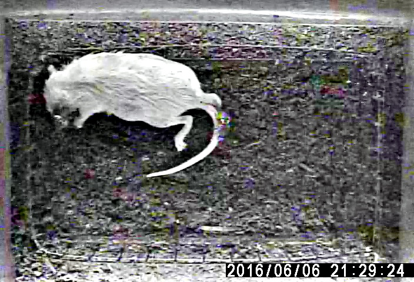

# cv-playground
Conventional Computer Vision experiment

## Image preprocess

Implement the Retinex for image preprocessing which is fork and modified from [dongb5](https://github.com/dongb5/Retinex)

- Single Scale Retinex (SSR)
- Multi Scale Retinex (MSR)
- Multi Scale Retinex Color Restoration (MSRCR)
- automated MSRCR
- Multi Scale Retinex with Chromaticity Preservation (MSRCP)

| origin | MSRCR | autoMSRCR | MSRCP |
| --- | --- | --- | --- | --- |
|  |  |  |  |

## Contour

Transform the form of contours into the shape of (?, 1, 2)

### OpenCV

Simple but effective method to get the contour by threshold (OTSU)

- convert to grayscale image
- GaussianBlur
- get a mask by given threshold
- find the contour by given mask

### Active Contour (skimage)

The Same process as OpenCV but the last function is different where is implement in skimage.

## Optical Flow

demo code with lucas-kanade (sparse optical flow)

> the path on the lucas-kanade demo image is the beetle tracking path

## Reference

**Retinex**

- https://blog.csdn.net/ajianyingxiaoqinghan/article/details/71435098
- https://cloud.tencent.com/developer/article/1011768
- https://github.com/dongb5/Retinex